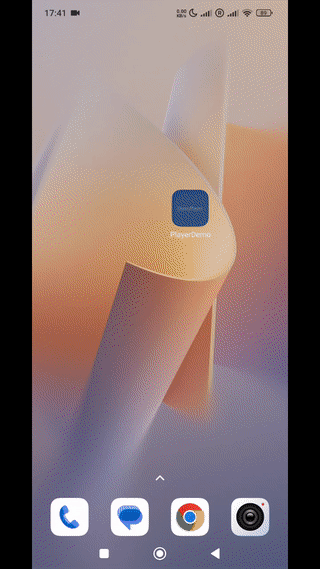
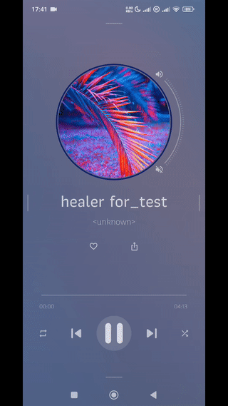
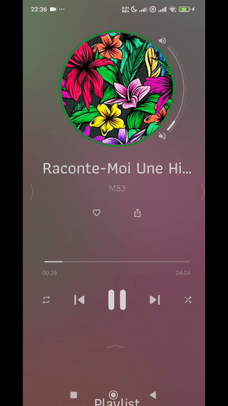

## Player demo on media3 with spectrogram and multi-directional sliding UI.

Minimum required API: 24

| *gif1 (2mb)*      | *gif2 (3mb)*       | *gif3 (2mb)*       | *gif4 (2mb)*         |
|-------------------|--------------------|--------------------|----------------------|
|  |  |  |  |